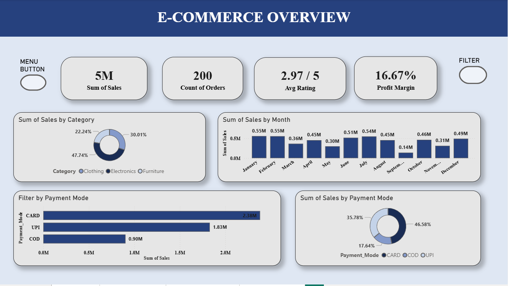
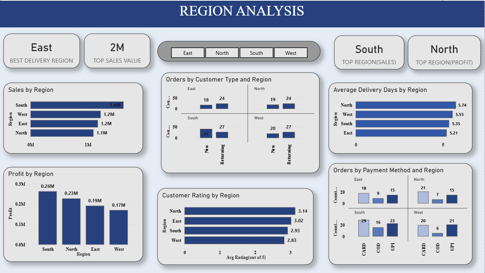
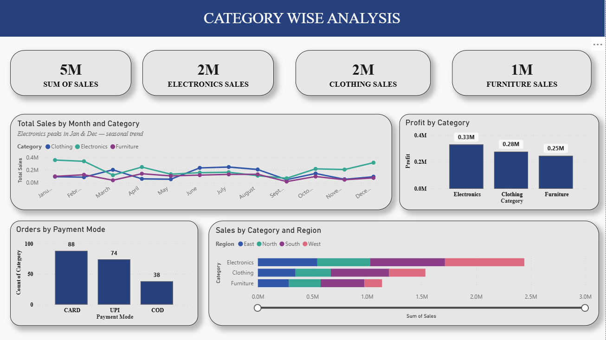
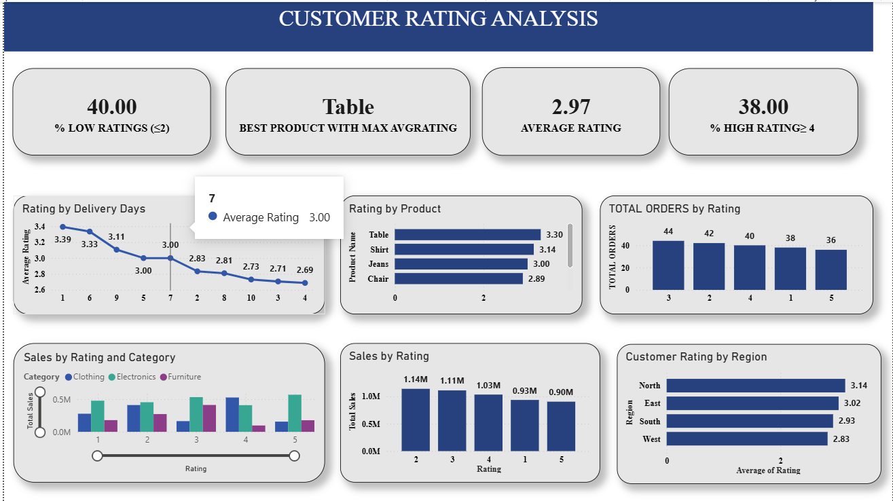

# E-Commerce Sales & Customer Analysis - Power BI Dashboard

## Project Overview
An interactive 4-page Power BI dashboard analyzing e-commerce 
sales performance, customer behaviour, regional trends, 
and product ratings.

## Dashboard Pages
- **Page 1 - E-Commerce Overview:** KPIs, sales by category, 
  payment mode analysis
- **Page 2 - Region Analysis:** Sales and profit by region, 
  delivery days, customer type breakdown
- **Page 3 - Category Analysis:** Monthly trends, 
  profit by category, regional sales comparison
- **Page 4 - Rating Analysis:** Customer satisfaction metrics, 
  rating distribution, product and region ratings

## Dashboard Preview

### Page 1 - E-Commerce Overview

### Page 2 - Region Analysis

### Page 3 - Category Analysis

### Page 4 - Rating Analysis

## Key Insights
- Electronics dominates sales at 47.74% of total revenue
- South region leads in both Sales and Profit
- 40% of orders received low ratings (≤2) — satisfaction is polarised
- Electronics peaks in January and December — seasonal demand pattern
- CARD is the most preferred payment method (46.58%)

## Tools Used
- Power BI Desktop
- DAX for calculated measures

## Skills Demonstrated
- DAX measures (DIVIDE, CALCULATE, FORMAT, MIN, MAX)
- Interactive slicers and cross-filtering
- Dashboard design and storytelling
